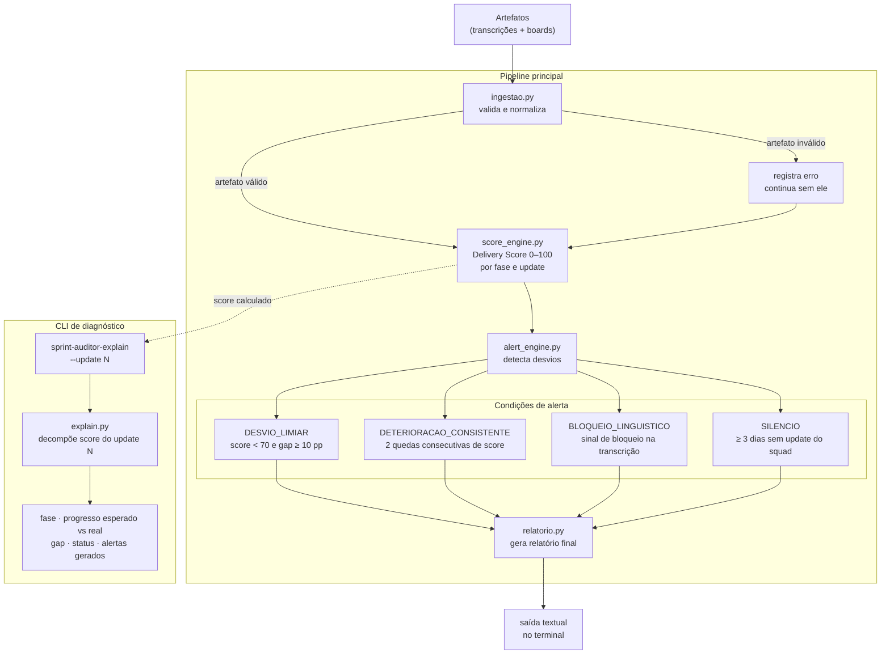

# Sprint Auditor

Agente de auditoria que detecta desvios de entrega antes do comitê semanal.

Dado um projeto de onboarding (15 dias do kickoff à produção), o sistema ingere artefatos textuais — transcrições de calls e exports de board — calcula um **Delivery Score** (0–100) por update e dispara alertas rastreáveis quando o projeto está desviando, com causa provável, hipótese causal, nível de confiança e ação sugerida.

---

## Pipeline



---

## Saída de exemplo

```
============================================
SPRINT AUDITOR — Onboarding Alpha Corp
Kickoff: 2026-04-28
============================================

─── Update #1 — Dia 3 ──────────────────────
Delivery Score: ████████░░  83/100

Projeto no trilho — nenhum desvio detectado.

─── Update #2 — Dia 6 ──────────────────────
Delivery Score: ████░░░░░░  40/100  [DESVIO]

⚠ DESVIO_LIMIAR (confiança: ALTA)
  Fase: configuracao | Dia: 6 | Gap: 60.0 pp
  Causa: Score 40 está abaixo do limiar 70 — progresso real 0% contra 60%
         esperado para a fase configuracao no dia 6
  Hipótese: Fase configuracao travada em 0% no dia 6. Hipótese: dependência
            externa — sinalizado na transcrição ('aguardando aprovação').
            Escalar para o FDE Lead pedir intervenção do sponsor do cliente.
  Ação: Bloqueio externo confirmado por sinal linguístico → escalar para o FDE Lead
  Fonte: art-u2-board | "Configuração: [✗] Acesso ao ambiente SAP, ..."

⚠ SILENCIO (confiança: MÉDIA)
  Fase: configuracao | Dia: 6
  Causa: Squad sem sinal há 3 dias — último update foi no dia 3
  Ação: Contatar FDE Lead para status — squad sem sinal há 3 dias
  Fonte: sistema | "Sem update há 3 dias (último: dia 3)"

════════════════════════════════════════════
RESUMO DA DEMO
════════════════════════════════════════════
✓ Alerta disparado: Dia 6 — semana 1, antes do comitê
✗ Comitê semanal detectaria: Dia 12 — semana 2, tarde demais
  Antecipação: 6 dias
════════════════════════════════════════════
```

---

## Instalação

Requer Python ≥ 3.11 e [`uv`](https://docs.astral.sh/uv/).

```bash
uv sync
```

---

## Uso

```bash
# Pipeline completo com o projeto sintético
uv run sprint-auditor-demo

# Decompor o score de um update específico
uv run sprint-auditor-explain --update 2
```

Saída do `explain` para o Update 2:

```
════════════════════════════════════════════
Decomposição do Score — Update #2 (Dia 6)
════════════════════════════════════════════
  Fase:               configuracao
  Progresso esperado: 60%
  Progresso real:      0%
  Gap:                 60 pp
  Score (100 - gap):   40/100
  Limiar de desvio:    70
  Status:              ⚠ ABAIXO DO LIMIAR
  Alertas gerados:     2
════════════════════════════════════════════
```

---

## Desenvolvimento

```bash
# Testes (128 testes, todos passando)
uv run pytest tests/ -v

# Lint
uv run ruff check src/ tests/

# Type-check
uv run mypy src/

# Formatar
uv run ruff format src/ tests/
```

---

## Arquitetura

### Módulos

| Arquivo | Responsabilidade |
|---|---|
| `modelos.py` | Dataclasses Pydantic: `Projeto`, `Update`, `Artefato`, `DeliveryScore`, `Alerta` |
| `template_fases.py` | Curva de progresso esperado (%) por dia para cada uma das 4 fases |
| `seed.py` | Projeto sintético "derrapado" com 4 updates cobrindo artefatos distintos |
| `ingestao.py` | Validação e normalização de artefatos; artefato inválido → registra e continua |
| `score_engine.py` | Cálculo do Delivery Score (0–100) por fase e por update |
| `alert_engine.py` | Detecção dos 4 tipos de alerta com rastreabilidade de fonte |
| `relatorio.py` | Geração do relatório textual com hipótese causal e histórico de scores |
| `explain.py` | CLI de diagnóstico: decompõe o score de um update em seus componentes |
| `demo_pipeline.py` | Entry point de demo: carrega seed, processa todos os updates, imprime relatório |

### Fases do projeto

| Fase | Dias |
|---|---|
| Discovery | 1–3 |
| Configuração | 4–7 |
| Desenvolvimento | 8–12 |
| Review | 13–15 |

### Tipos de alerta

| Categoria | Condição |
|---|---|
| `DESVIO_LIMIAR` | Score < 70 com gap ≥ 10 pp em relação ao esperado |
| `DETERIORACAO_CONSISTENTE` | Dois drops consecutivos de score sem cruzar o limiar |
| `BLOQUEIO_LINGUISTICO` | Sinais na transcrição: "aguardando aprovação", "bloqueado", "não pode avançar" |
| `SILENCIO` | Squad sem nenhum update há ≥ 3 dias |

### Regras de negócio inegociáveis

- **Silêncio é informação.** Sem desvio → nenhum alerta.
- **Todo alerta é rastreável.** Aponta artefato-fonte e trecho que originou a causa.
- **Nunca inventar um score.** Sem base suficiente → `dados_suficientes=False`.
- **Causa provável vem com nível de confiança.** Nunca apresentada como certeza.

---

## Stack

- Python 3.11+
- [Pydantic v2](https://docs.pydantic.dev/) — modelos de domínio
- [pytest](https://pytest.org/) — 128 testes
- [ruff](https://docs.astral.sh/ruff/) — lint + format
- [mypy](https://mypy-lang.org/) — type-check
- [uv](https://docs.astral.sh/uv/) — gerenciador de pacotes e ambiente

---

## Documentação

- [`docs/specs/sprint-auditor.md`](docs/specs/sprint-auditor.md) — SPEC do produto
- [`docs/plans/sprint-auditor.md`](docs/plans/sprint-auditor.md) — plano de tarefas
- [`docs/tech-specs/`](docs/tech-specs/) — tech specs de T01 a T07
